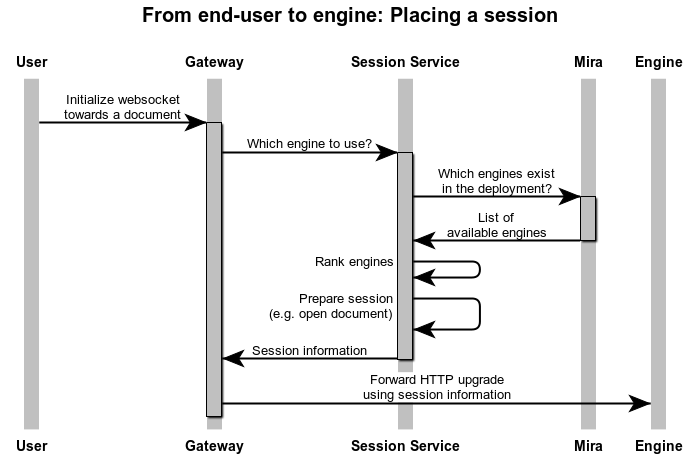

# Qlik Associative Engine Sessions

Qlik Associative Engine session requests from the web browser needs to be routed to one of the available Qlik Associative Engine instances.

To open a Qlik Associative Engine session, the client implementation running in the browser, can do this in one step by opening a
WebSocket, just as if connecting to a Qlik Associative Engine directly.

The login session cookie is sent together with the WebSocket HTTP upgrade request in order to
connect the user with the corresponding JWT on the backend side. This is done before the WebSocket upgrade request is
completed which makes JWT management it totally hidden from client. Redirections and WebSocket upgrade is managed by the
OpenResty gateway.

Since scheduling the WebSocket request to one of the available Qlik Associative Engine instances is also done in the
context of the upgrade request, the actions needed to find and schedule the session are carried out by the
QIX Session Service, using Mira to find which Qlik Associative Engine instances that are available.

## Collaborating Components

### Web Browser

- Requests to open WebSocket connection to the Assisted Prescription document.
- Passes the session cookie (obtained at login) in the upgrade request.

### Gateway

- Receives the WebSocket upgrade request.
- Uses login session cookie to look up entry in the Session DB and to retrieve the corresponding JWT.
- Makes a requests to Session Service to obtain QIX session id and an URL to the actual Qlik Associative Engine instance to use.
- The Gateway can now complete the WebSocket upgrade request by connecting to the selected engine instance.
- Further communication from the browser over the WebSocket is now properly forwarded by the Gatwey to the engine
  instance serving the session.

### Session DB

- Keeps track of users by storing login sessions and associating each login with a JWT.

### Session Service

- To obtain the QIX session id, Mira is queried for available Qlik Associative Engine instances.
- Among the available engine instances the Session Service selects one using a least-load strategy.
  The strategy is in detail described [here](https://qlikcore.com/docs/tutorials/scalability/newspaper/).
- The document is opened and the session is prepared. This determines the QIX session id.
- The WebSocket is closed but by utilizing the session TTL feature in Qlik Associative Engine, the engine keeps the session alive
  in order to enable a later reconnect to it (from the Gateway).

A high-level sequence diagram can be seen below.

### Mira

- Mira is the Qlik Associative Engine discovery service that periodically refreshes a list of available Qlik Associative Engine instances.
- When Mira has discovered a Qlik Associative Engine instance, it periodically requests both its health and metrics endpoints.
- The typical usage scenario of Mira is to be able to do QIX session scheduling as done by the Session Service in this
  application.
