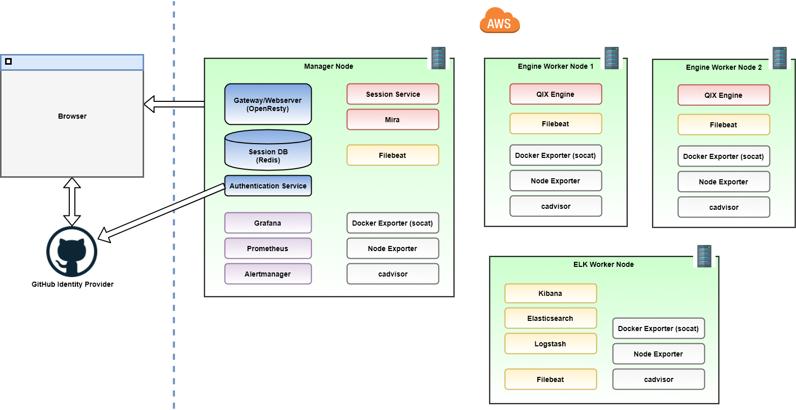

# System Overview

The image below shows a schematic overview of services and deployment on different nodes.

(This diagram is created using [draw.io](https://www.draw.io/) with the diagram source available
[here](../images/system-overview.xml).)

## AWS Infrascructure

All backend services run in a single Docker Swarm cluster with one manager node and two different kinds of multiple
worker nodes.

#### Manager Node

The manager node runs the web gateway, services related to authentication, services related to Qlik Associative Engine session management, and Grafana, Prometheus, and Alertmanager for metrics monitoring.

#### Engine Workers

These nodes are dedicated to run one single Qlik Associative Engine instance each. Only a minimal required set of additional services
run on these nodes. Also, these are the nodes that can be scaled up or down.

The default configuration on AWS is two run two engine worker nodes.

#### ELK Worker

This worker node runs the ELK stack. This offloads the manager node and engine worker nodes from services possibly
impacting Qlik Associative Engine performance negatively.

## Design Aspects

Different design aspects of the system are covered in separate sections:

- [Authentication](./authentication.md)
- [Qlik Associative Engine Sessions](./qix-engine-sessions.md)
- [Monitoring](./monitoring.md)
